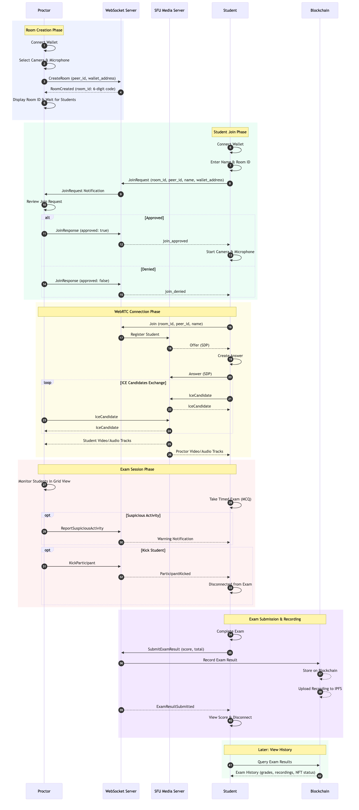

# SFU UI

React frontend for the decentralized exam proctoring platform with real-time video monitoring and blockchain integration.

## Proctoring Flow



## Setup

```bash
# Install dependencies
npm install

# Copy environment config
cp .env.example .env

# Start development server
npm run dev
```

## Configuration

Edit `.env` with your settings:

| Variable | Default | Description |
|----------|---------|-------------|
| `VITE_WS_URL` | `ws://localhost:8080/sfu` | WebSocket server URL |
| `VITE_STUN_SERVER_URL` | `stun:stun.l.google.com:19302` | STUN server for WebRTC |
| `VITE_IPFS_GATEWAY_URL` | `http://localhost:8081/ipfs` | IPFS gateway for recordings |
| `VITE_REOWN_PROJECT_ID` | - | Reown Project ID (get from [cloud.reown.com](https://cloud.reown.com)) |
| `VITE_CONTRACT_ADDRESS` | - | Proctoring smart contract address |
| `VITE_CHAIN_ID` | `1287` | Chain ID |
| `VITE_CHAIN_NAME` | `Moonbase Alpha` | Chain name |
| `VITE_CHAIN_RPC_URL` | `https://rpc.api.moonbase.moonbeam.network` | Chain RPC URL |
| `VITE_CHAIN_EXPLORER_URL` | `https://moonbase.moonscan.io` | Block explorer URL |
| `VITE_CHAIN_EXPLORER_NAME` | `Moonscan` | Block explorer name |
| `VITE_CHAIN_CURRENCY_NAME` | `DEV` | Native currency name |
| `VITE_CHAIN_CURRENCY_SYMBOL` | `DEV` | Native currency symbol |

## Scripts

| Command | Description |
|---------|-------------|
| `npm run dev` | Start development server |
| `npm run build` | Build for production |
| `npm run preview` | Preview production build |
| `npm test` | Run tests in watch mode |
| `npm run test:run` | Run tests once |
| `npm run test:coverage` | Run tests with coverage |